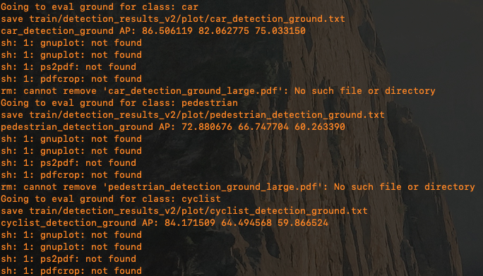
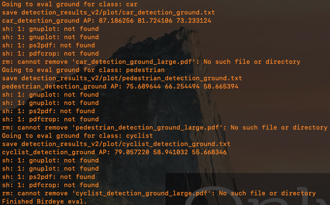
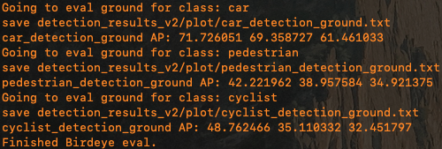

## Efficient Frustum PointNets for 3D Object Detection from RGB-D Data

This repository contains code released for applying the **Delayed-Aggregation** method to [Frustum PointNets](https://arxiv.org/abs/1711.08488). The original implementation is [here](https://github.com/charlesq34/frustum-pointnets). 

### Environment/Libraries:
It is necessary to install the right version of libraries to get the code running. (The one that works on your machine is the right version.)
We have been experimenting in the environment below: <br>

OS: Ubuntu 18.04.3 LTS <br>
Python: 2.7 <br>
Dependencies: Tensorflow 1.12.0, numpy 1.14, CUDA 10.2, cudnn 7.6.5

Compiler Toolchain: 
- gcc / gxx: 7.3.0 (to compile the tf ops)

### Installation
Install <a href="https://www.tensorflow.org/install/">TensorFlow</a>.There are also some dependencies for a few Python libraries for data processing and visualizations like `cv2`, `mayavi`  etc. It's highly recommended that you have access to GPUs.

Suppose the root directory is at `frustum-pointnets`. Compile several custom Tensorflow operators from PointNet++. The TF operators are included under `models/tf_ops`, you need to compile them (check `tf_xxx_compile.sh` under each ops subfolder) first. Update `cuda` and `python` path if necessary. Assuming the paths are all correct. you can use the script `compile.py` to compile those modules.
```
 $ python compile.py
```
Then, compile the evaluation code in `train/kitti_eval`, go to the directory `train/kitti_eval` and run:
```
$ ./compile.sh
```
Check `train/kitti_eval/README.md` for details.

Next, download the prepared data files <a href="https://shapenet.cs.stanford.edu/media/frustum_data.zip" target="_blank">HERE (960MB)</a> and just unzip the file and move the `*.pickle` files to the `kitti` folder.

You can run `python train/provider.py` to visualize the training data (frustum point clouds and 3D bounding box labels, in rect camera coordinate).


### Training

To start training our **full Delayed-Aggregation version**, just run the following script:
```
$ bash scripts/command_train_v2.sh
```
To train the original Frustum PointNets **baseline version**, just run the following script:
```
$ bash scripts/command_train_v2_baselline.sh
```
To train the **limited Delayed-Aggregation version**, just run the following script:
```
$ bash scripts/command_train_v2_limited.sh
```

Run `python train/train.py -h` to see more options of training. 


### Evaluation
To evaluate a trained model on the validation set using our **Delayed-Aggregation version**, just run:
```
$ bash scripts/command_test_v2.sh
```
or evaluate the original **Baseline version** model:
```
$ bash scripts/command_test_v2_baseline.sh
```
or evaluation the **limited Delayed-Aggregation version** model:
```
$ bash scripts/command_test_v2_limited.sh
```

**NOTE**: In our paper, we report the accuracy from the `Eval` set.

**Delayed-Aggregation version**:



**Baseline version**:



**Limited elayed-Aggregation version**:



To reproduce the accuracy (BEV accuracy), please use the commands in [**Evaluation**](#Evaluation).
